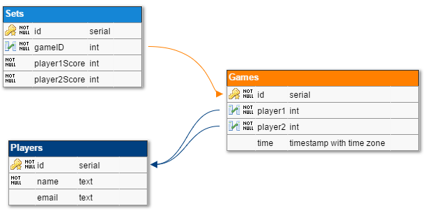

# ping-table
A Ping Pong League Table

# Features
- Add and remove games from the league
- League table showing top 5 players
- List of game results
- Winning % of each user, as won/total games played
- User avatars via Gravatar
- Autocomplete player names

# Usage
## Configuration
Edit `config.json` with your desired values. 

## Development
To develop, with hot-reload for Vue components:
```
# Start Node 
npm run
# Now in a seperate terminal, start Webpack for Frontend Development
cd public
npm install
npm run dev
```
View on `http://localhost:8080`

When done with frontend, compile for distribution:
```
cd public
npm run build
```

# Technology

## Backend
**Node.js (v7.9.0)** - API Server, using Express, and Objection (Postgres ORM)

## Database
**Postgres** - Perisistant storage

### Schema
 

## Frontend
**Vue.js (2.0)** and **Bulma CSS* - Vue allows for modular building, encouraging separation of concerns, and code reuse. Bulma provides a modern grid system, as well as some utility classes. 
The frontend has been structued as follows (component-wise), and have Vue components for each:
 - Home
    - Player Board
    - Add Player Box
    - Add Game Box
    - Latest Scoreboard

`App.vue` is the entry point, and contains some global CSS classes for buttons and inputs (however, these can be refactored into Vue components later)